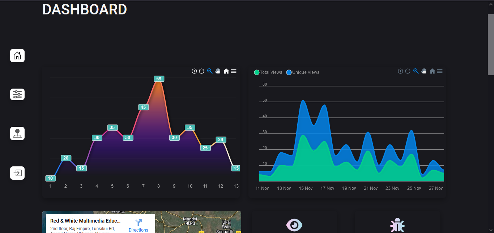

# jQuery Admin Panel Practical
View the Website [here](https://jquery-practical-daksh.netlify.app/)

## Preview

## Features
- Feature 1: Working Login Page
- Feature 2: Dynamic Counters
- Feature 3: Dynamic Apexcharts
- Feature 4: Responsive
- Feature 5: Working Slider without JS
## Tech Stack
This project is built using the following technologies:
- **Frontend:**
- HTML5
- CSS3
- JavaScript
- jQuery

## Plugins and Libraries
This project uses the following plugins and libraries:

- **jQuery**: For DOM manipulation and event handling
- **ApexCharts**: For creating dynamic charts
